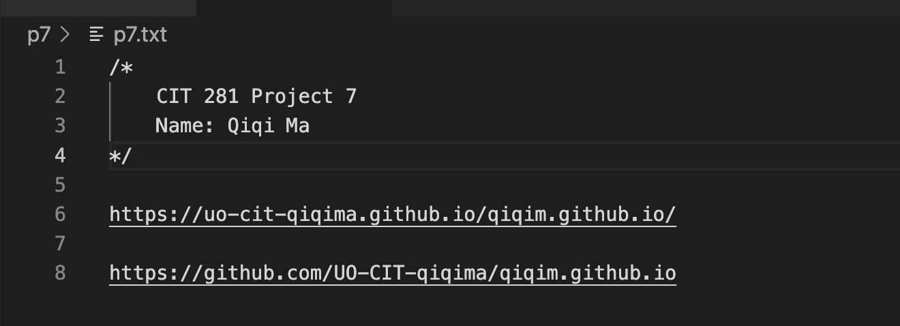

# cit281-project-7

[cit281-project-7](https://github.com/UO-CIT-qiqima/cit281-project-7)

Project 7:

1. I am creating either an organization-level GitHub Page with some content.
2. I am creating repos for each of the labs and projects for the CIT 281 class.
3. I add a brief description of the lab or project or add a screen capture to make it look nicely.
4. I also add links to the organization or user Page to each of the labs and projects.

